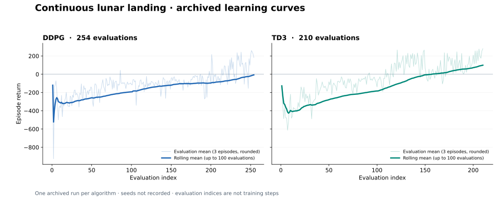

# Lunar Lander — Deep Reinforcement Learning with DDPG & TD3

**Learning continuous control through interaction, from an untrained policy to evaluated lunar-landing agents.**

A university team project implementing **Deep Deterministic Policy Gradient (DDPG)** and **Twin Delayed DDPG (TD3)** in PyTorch for the continuous version of Gymnasium's `LunarLander-v3`. The agents learn to control the main and lateral engines from an eight-dimensional observation, using replay memory, neural actor–critic networks and target networks.

The repository combines the implementations with **archived evaluations, learning curves and policy videos**, plus a seeded command-line runner for new experiments.



[Results](#archived-results) · [Policy videos](#policy-videos) · [Run the project](#run-the-project) · [Implementation](#implementation) · [Team](#academic-context-and-team)

## What the project delivers

- Two working off-policy agents for a continuous action space, implemented directly in PyTorch.
- A comparison of the learning trajectories recorded during the original academic experiments.
- Initial and final policy videos for both algorithms.
- Separate training and evaluation environments, seeded execution and exports of metrics, configuration and final model weights for new runs.
- An analysis script that regenerates the published figure and a machine-readable results summary from the original CSV files.

## Archived results

The recorded TD3 run achieved a higher final rolling evaluation return and a higher average over its last 20 evaluations than the recorded DDPG run. Both trajectories show substantial improvement from their early negative returns, with considerable variability between evaluations.

| Measure | DDPG | TD3 |
| --- | ---: | ---: |
| Recorded evaluations | 254 | 210 |
| Final rolling mean, last 100 evaluations | −7.58 | 99.12 |
| Mean of the last 20 recorded evaluation values | 117.40 | 156.40 |
| Best recorded evaluation value | 259 | 280 |
| Training steps at the final archived log entry | 140,119 | 121,059 |

**How to read these numbers:** after each completed training episode, the original code evaluated the deterministic policy on three episodes. The CSV column `Episode Reward` contains that three-episode mean **rounded to an integer**; it is not the training episode's return. `Mean R` contains the rolling mean of up to 100 **unrounded** evaluation means. The last-20 and best values above use the rounded CSV values. The figure's horizontal axis is the evaluation index, not the number of training steps.

The table is derived from [ddpg.csv](ddpg.csv), [td3.csv](td3.csv) and the saved output in [RunDDPG_Colab.ipynb](RunDDPG_Colab.ipynb). The numerical summary is also available in [assets/archived-results.json](assets/archived-results.json).

**Scope of the comparison:** there is one archived run per algorithm, the original random seeds were not recorded, and the runs used different hyperparameters and training lengths. These observations describe the stored experiments; they do not establish that TD3 is statistically superior. The final 100-evaluation rolling means remain below 200, so this project does not claim a solved benchmark.

## Policy videos

The original recordings are preserved with their original filenames. Open each video to inspect the policies from the academic experiments.

| Agent | Initial policy | Final policy |
| --- | --- | --- |
| DDPG | [Watch initial recording](Videos/rl-video-episode-inici_DDPG.mp4) | [Watch final recording](Videos/rl-video-episode-final_DDPG.mp4) |
| TD3 | [Watch initial recording](Videos/rl-video-episode-inici_TD3.mp4) | [Watch final recording](Videos/rl-video-episode-final_TD3.mp4) |

## Implementation

The actor maps eight observation features through hidden layers of 400 and 300 units to two bounded actions. The networks use LayerNorm and ReLU; the actor applies `tanh` at its output. Each critic combines state and action representations to estimate a scalar action value. Transitions are sampled from a replay buffer with capacity for one million entries.

| Component | DDPG | TD3 |
| --- | --- | --- |
| Value estimation | One critic | Two critics; minimum target value |
| Policy updates | Every learning update | Every two critic updates |
| Target action | Deterministic target actor | Target actor with clipped Gaussian smoothing |
| Exploration | Ornstein–Uhlenbeck noise | Gaussian noise |
| Runner batch size | 64 | 100 |
| Actor learning rate | 0.0001 | 0.001 |
| Critic learning rate | 0.001 | 0.001 |
| Target update coefficient | 0.001 | 0.005 |
| Discount factor | 0.99 | 0.99 |

DDPG uses critic weight decay of 0.01. TD3 uses target-policy noise of 0.2, clipped to ±0.5. The academic TD3 implementation samples a scalar exploration perturbation with standard deviation 0.1 and shares it across the action components; this behavior is retained and recorded in new run configurations.

Terminal transitions stop value bootstrapping, while time-limit truncations retain it. The original early-stop rule is also retained: more than ten evaluations and a mean return above 220 over the last five evaluations. This is a training heuristic, not a robust performance certification.

## Run the project

### 1. Install dependencies

Verified on **Python 3.12.14**, with PyTorch 2.14.1 and Gymnasium 1.3.0. The commands below use a macOS/Linux shell. Box2D needs SWIG and a working C/C++ build toolchain.

```bash
git clone https://github.com/joelalfaroupc/APRNS-LAB-7.git
cd APRNS-LAB-7
python3.12 -m venv .venv
source .venv/bin/activate
python -m pip install --upgrade pip
python -m pip install swig==4.5.0
python -m pip install -r requirements.txt
```

### 2. Explore the existing results

```bash
python analyze_results.py
```

This reads the two archived CSVs and regenerates the SVG, PNG and JSON summary in `assets/`. No training is required. For an interactive view, open [plots.ipynb](plots.ipynb) in a notebook editor with the repository root as its working directory; Jupyter is optional and is not required by the command-line tools.

### 3. Run a short functional check

```bash
python train.py --algorithm td3 --steps 32 --batch-size 4 \
  --max-episode-steps 8 --seed 42 --output runs/smoke
```

The shortened episodes make this a quick check of training and exports. It is not an experiment for measuring landing performance.

### 4. Train an agent

```bash
python train.py --algorithm ddpg --steps 500000 --seed 42 \
  --output runs/ddpg-seed42

python train.py --algorithm td3 --steps 500000 --seed 42 \
  --video-episodes 3 --output runs/td3-seed42
```

Training uses a separate evaluation environment and a default episode limit of 1,000 steps. The requested step count is a maximum because the original early-stop rule can finish a run earlier. `--video-episodes` records the final policy in a third environment. CPU is used by default unless CUDA is available; Apple MPS is not selected by these networks.

Each output directory must be empty to avoid overwriting an experiment. Run `python train.py --help` for all options.

### Saved artifacts

| File | Contents |
| --- | --- |
| `training.csv` | Completed training episodes, their end steps and returns |
| `evaluations.csv` | End steps, three-episode evaluation means and rolling means |
| `config.json` | Seeds, hyperparameters, requested/completed steps, device and core library versions |
| `actor.pt` | Final actor state dictionary |
| `critic.pt` or `critic1.pt` / `critic2.pt` | Final critic state dictionaries |
| `videos/` | Optional final-policy recordings |

Evaluation returns are exported without integer rounding. A partially completed final training episode is not included in the episode CSVs; `config.json` records all completed training steps. Weight files contain final model parameters, not optimizer state or replay memory, so they support inference but are not resumable training checkpoints.

To load an actor saved by a new run:

```python
import torch
from ActorCriticNetworks import ActorNetwork

actor = ActorNetwork(8, 2)
actor.load_state_dict(torch.load(
    "runs/td3-seed42/actor.pt", map_location=actor.device, weights_only=True
))
actor.eval()
# observation is an eight-element array returned by env.reset() or env.step().
with torch.no_grad():
    action = actor(torch.as_tensor(
        observation, dtype=torch.float32, device=actor.device
    )).cpu().numpy()
```

The archived experiments do not include trained weight files. New seeded runs use improved evaluation isolation and export handling, so they should be treated as new experiments rather than exact reconstructions of the original curves. Repeated short CPU runs are deterministic in the tested environment; identical results across devices and library versions are not guaranteed.

## Repository guide

| Path | Purpose |
| --- | --- |
| `DDPG.py` / `TD3.py` | Agents, updates, training loops and evaluation |
| `ActorCriticNetworks.py` | Actor and critic network architectures |
| `ReplayBuffer.py` / `Noise.py` | Replay sampling and exploration utilities |
| `train.py` | Seeded training, metrics, weights and video export |
| `analyze_results.py` | Archived-result analysis and figure generation |
| `plots.ipynb` | Interactive analysis using repository-relative paths |
| `RunDDPG_Colab.ipynb` | Original academic notebook with saved training output |
| `ddpg.csv` / `td3.csv` / `Videos/` | Original evidence from the experiments |
| `tests/test_portfolio.py` | Functional and regression checks |

## Validation

```bash
python -m pip install -r requirements-dev.txt
python -m pytest tests -q
```

Ten automated checks pass in the tested Python 3.12 environment. They cover rolling-window plotting, short and single-step runs, real Box2D parameter updates for both agents, isolation of the evaluation environment, repeatable seeded CSV exports and loading the saved actor. The analysis notebook cells and final-policy video generation were also checked locally.

These checks exercise the pipeline with short runs; the full archived training sessions were not rerun. Performance claims above come from the preserved academic evidence.

## Academic context and team

Developed for **APRNS at Universitat Politècnica de Catalunya (UPC)** by [Joel Alfaro Sanchez](https://github.com/joelalfaroupc) and [Oriol Martí Sanahuja](https://github.com/urimmarti).

The repository preserves the original team commit history, CSVs, training notebook and policy recordings. The portfolio edition documents the project, makes the results easier to inspect and improves the workflow for running new experiments.
